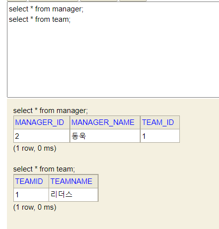

# JPA_Setting_Study

### 목차
#### [1. JPA 소개](#JPA-소개)
#### [2. Entity 내 각 컬럼 속성 관리 어노테이션 정리](#Entity-내-각-컬럼-속성-관리-어노테이션-정리)
#### [3. 연관관계 매핑 방법](#연관관계-매핑-방법)
#### [4. JPA 사용 시 주의사항](#JPA-사용-시-주의사항)
#### [5. 활용한 강의들](#활용한-강의들)


### JPA 소개
* Java Persistence API의 약자로 객체 관계 매핑을 위한 POJO persistence Model을 제공하는 API
  * 관계형 데이터베이스와 매핑이 가능하며 매핑 정보를 기반으로 객체를 활용해 데이터 조회, 생성, 수정, 삭제 등의 작업이 가능
  * 이를 통해 더 이상 개발자들이 SQL문을 작성하는데 불필요한 시간을 줄여주고 핵심 로직을 개발하는데 시간을 사용할 수 있게 함으로써 개발 효율성 향상
  * DB 마이그레이션 시에도 원하는 관계형 데이터베이스 정보만 속성 값에서 변경해주면 JPA가 알아서 해당 DB에 맞게 매핑하기 때문에 마이그레이션 시간도 단축 가능
* 기존에는 EJB 전문가 그룹에 의해 개발되었지만 추후 웹 애플리케이션 및 애플리케이션 클라이언트가 직접하숑할 수 있게 Java EE, Java SE 등에서도 사용 가능해진 상태
<br/><br/><br/><br/>

### Entity 내 각 컬럼 속성 관리 어노테이션 정리
#### 종류
1. @Id - 해당 Table의 Primary Key 컬럼 위에 사용. 무조건 있어야 하며 없을 시 오류 발생
   * @GeneratedValue
     * Id에 해당하는 컬럼의 value들을 자동으로 넣어주고자 할 때 사용(Auto increment와 같이)
     * 사용 예시 
       * @GeneratedValue(strategy = GenerationType.AUTO)
       * GenerationType에 따라 관계형 DB에 매핑
         * IDENTITY - 데이터베이스에 위임(MySQL)
         * SEQUENCE - 데이터베이스 시퀀스 오브젝트 사용(ORACLE)
           * @SequenceGenerator 필요 
         * TABLE - 키 생성용 테이블 사용, 모든 DB에서 사용
           * @TableGenerator 필요
         * AUTO - 방언에 따라 자동 지정, 기본값
   * 키 지정 시 주의사항
     * Long타입 사용을 통해 대량의 데이터 처리가 가능하도록 조정
     * 대체키 사용을 통해 비지니스로직과는 전혀 상관없는 키를 운용
       * 나중에 비지니스 로직이 바뀌어도 변경할 필요가 없게
     * 키 생성전략 사용(GeneratedValue)
2. @Column 
   * 해당 컬럼의 이름, 제약 조건 및 타입을 관리하기 위해 적용
   * name - 컬럼명 설정
   * length - 해당 데이터타입의 길이 설정 기본 255
   * nullable - null값 가능여부
   * unique - DB unique 제약조건과 동일
3. @Temporal
   * 날짜 타입은 @Temporal 사용
   * DATE - 날짜
   * TIME - 시간
   * TIMESTAMP - 날짜와 시간
4. @Transient
   * DB랑 매핑할 필요는 없는데 해당 Domain에서 관리해야되는 변수가 존재할 때는 @Transient 사용

#### 예시
```
public class Member {
    @Id @GeneratedValue(strategy = GenerationType.AUTO)
    private Long id;
    private String name;
    @Column(name = "PHONE_NUMBER", length = 50, nullable = false)
    private String user_phone_member;

    @Temporal(TemporalType.DATE)
    private Date reg_date;
    @Temporal(TemporalType.TIMESTAMP)
    private Date update_date;

    // DB랑 매핑할 필요는 없는데 해당 Domain에서 관리해야되는 변수가 존재할 때는 @Transient
    @Transient
    private String tempData;
}
```
<br/><br/><br/><br/>

### 연관관계 매핑 방법
1. 연관관계 미설정 시 
   * 저장 자체에는 문제가 없음<br/>
   하지만 연관관계가 설정되어 있지 않아 조회 시에도 따로 두번 불러야만 조회 가능한 구조<br/>
   너무 데이터 지향적인 코딩이며 객체 지향과는 어울리지 않는 코딩 방식<br/>
   * Manager
   ```java
   @Entity
   @Getter
   @Setter
   public class Manager {
       @Id @GeneratedValue(strategy = GenerationType.AUTO)
       @Column(name = "MANAGER_ID")
       private Long managerId;
       @Column(name = "MANAGER_NAME")
       private String managerName;
       @Column(name = "TEAM_ID")
       private Long teamId;
   }

   ```

   * Team
   ```java
   @Entity
   @Getter
   @Setter
   public class Team {
       @Id @GeneratedValue(strategy = GenerationType.AUTO)
       private Long teamId;
       private String teamName;
   }
   ```

   * TestCode
   ```java
   @Test
   void tableRelationshipMapping(){
    // 서버 실행 시 EntityManagerFactory는 한번만 실행
    EntityManagerFactory emf = Persistence.createEntityManagerFactory("jpa_setting_study");
    EntityManager em1 = emf.createEntityManager();
    EntityTransaction et1 = em1.getTransaction();
    et1.begin();

    // 아래 Try Catch블럭에 있는 방식으로도 조회는 가능 하지만 연관관계가 설정되어 있지 않아 조회 시에도 따로 두번 불러야만 조회 가능
    try {
       Team team = new Team();
       team.setTeamName("리더스");
       em1.persist(team);

       Manager manager = new Manager();
       manager.setManagerName("동욱");
       manager.setTeamId(team.getTeamId());
       em1.persist(manager);
       et1.commit();

       Team findOneTeam = em1.find(Team.class, team.getTeamId());
       System.out.println("findOneTeam : " + findOneTeam.getTeamName()); // findOneTeam : 리더스
       Manager findOneManager = em1.find(Manager.class, manager.getManagerId());
       System.out.println("findOneManager : " + findOneManager.getManagerName()); // findOneManager : 동욱
     } catch (Exception ex){
       et1.rollback();
       System.err.println("Error Rollback : " + ex);
     } finally {
       em1.close();
       emf.close();
     }
   }
   ```

   * 결과
   
<br/><br/><br/><br/>

2. 연관관계 설정을 통해 해당 객체 자체를 가져와 매핑하는 방법(객체지향적인 )
   1. @ManyToOne(단방향 관계) 매핑
      * @JoinColumn을 활용해 Join할 객체의 PK값을 적어주어 FK 제약사항 설정<br/>
        1:N 관계 시에 사용되며 상위 객체에서는 하위 객체를 알 수 없고 하위 객체에서만 상위 객체를 조회 가능<br/>
        아래 예시에서는 Team에 Player들이 속해 있으므로 Team이 상위 객체, Player가 하위 객체<br/>
        따라서 Player에 ManyToOne으로 Team을 주입한 것을 볼 수 있음
      > 이를 통해 연관관계를 설정하지 않았을 때와 다르게 이번에는 Player만 조회하면 매핑된 Team을 조회 가능

      * Player.java
        ```java
          @Entity
          @Getter
          @Setter
          public class Player {
              @Id @GeneratedValue(strategy = GenerationType.AUTO)
              @Column(name = "PLAYER_ID")
              private Long playerId;
              @Column(name = "PLAYER_NAME")
              private String playerName;
              @ManyToOne
              @JoinColumn(name = "TEAM_ID")
              private Team team;
          }
        ```
        
      * Team.java
        ```java
          @Entity
          @Getter
          @Setter
          public class Team {
              @Id @GeneratedValue(strategy = GenerationType.AUTO)
              @Column(name = "TEAM_ID")
              private Long teamId;
              @Column(name = "TEAM_NAME")
              private String teamName;
          }
        ```
        
      * TestCode
        ```java
          @Test
          void manyToOneRelationshipMapping(){
            EntityManagerFactory emf = Persistence.createEntityManagerFactory("jpa_setting_study");
            EntityManager em = emf.createEntityManager();
            EntityTransaction et = em.getTransaction();
            et.begin();

            try{
              Team team = new Team();
              team.setTeamName("필라델피아 식서스");
              em.persist(team);
              System.out.println("??");

              Player player = new Player();
              player.setPlayerName("제임스하든");
              player.setTeam(team);
              em.persist(player);
              System.out.println("???");
              et.commit();

              Player newPlayer = em.find(Player.class, player.getPlayerId());
              System.out.println("Player Team Name : " + newPlayer.getTeam().getTeamName());
            } catch (Exception ex){
              et.rollback();
              System.err.println("Error Rollback : " + ex);
            } finally {
              em.close();
              emf.close();
            }
          }
        ```
   2. @ManyToMany(양방향 관계) 매핑

### JPA 사용 시 주의사항
1. EntityManagerFactory는 서버 실행 시 단일 인스턴스 후 전체 EntityManager 인스턴스 시 공유해 사용
   * 관계형 데이터베이스와 Connection 연결하는 부분이므로 여러번 할 필요가 없음
<br/>

2. EntityManager는 각 작업 단위별로 개별 생성 후 처리
   * EntityManager는 트랜젝션을 관리하기 때문에 데이터 정합성 오류가 발생할 위험 요소를 제거하기 위해 각 작업 단위별로 트랜젝션 처리 후 close 필요
<br/>

3. persistence.xml 내 property들 중 hibernate.hbm2ddl.auto의 value값은 개발, 운영 서버에서는 무조건 none으로 처리
   * create, update 등 사용 시 개발, 운영 데이터가 소실 또는 시스템 장애가 발생할 위험이 있음
<br/>

4. Build Tool이 Gradle일 때는 Entity로 활용할 Class들을 직접 등록해줘야 인식 가능
     ```
     <?xml version="1.0" encoding="UTF-8" ?>
     <persistence xmlns="http://xmlns.jcp.org/xml/ns/persistence" version="2.2">
         <persistence-unit name="jpa_setting_study">
             <!-- Gradle로 빌드 시에는 사용할 Entity를 등록해 줘야함 -->
             <class>com.study.jpa_setting_study.admin.member.domain.Member</class>
             <class>com.study.jpa_setting_study.admin.manager.domain.Manager</class>
             <class>com.study.jpa_setting_study.admin.manager.domain.Team</class>

             <!-- DB연결 속성값들 -->
             <properties>
                 <!-- 함수 속성 -->
                 <property name="javax.persistence.jdbc.driver" value="org.h2.Driver"/>
                 <property name="javax.persistence.jdbc.user" value="amway"/>
                 <property name="javax.persistence.jdbc.password" value="1234"/>
                 <property name="javax.persistence.jdbc.url" value="jdbc:h2:tcp://localhost/~/test"/>
                 <property name="hibernate.dialect" value="org.hibernate.dialect.H2Dialect"/>

                 <!-- 옵션 -->
                 <property name="hibernate.show_sql" value="true"/>
                 <property name="hibernate.format_sql" value="true"/>
                 <property name="hibernate.use_sql_comments" value="true"/>
                 <property name="hibernate.id.new_generator_mappings" value="true"/>
                 <property name="hibernate.hbm2ddl.auto" value="none"/>
             </properties>
         </persistence-unit>
     </persistence>
     ```
<br/>

5. Column 데이터 타입으로 @Enumerated를 활용해 Enum을 쓸 때는 EnumType.ORDINAL을 쓰게 되면 각 enum들을 0, 1, 2 ... 순서대로 숫자로 DB에 저장하게 됨
   * 이렇게 되면 Enum 타입이 하나 중간에 추가되면 DB전체 데이터를 모두 바꿔야하는 상황이 되버리므로 EnumType.STRING으로 저장 필수!
   * Member.java
    ```java
      @Entity
      @Getter
      @Setter
      public class Member {
          @Id
          private Long id;
          private String name;
          @Enumerated(EnumType.STRING)
          private MemberType memberType;
      }
    ```
  
   * MemberType.enum
    ```java
      public enum MemberType {
          ADMIN, USER
      }
    ```
  
   * TestCode
    ```java
      @Test
      void dbConnectionTest(){
        EntityManagerFactory emf = Persistence.createEntityManagerFactory("jpa_setting_study");
        EntityManager em = emf.createEntityManager();
        EntityTransaction et = em.getTransaction();
        et.begin();

        try {
          Member member = new Member();
          member.setId(1L);
          member.setName("동욱");
          member.setMemberType(MemberType.ADMIN);

          // EntitiyManager에 변경 내역 반영
          em.persist(member);
          // 실 DB에 Commit
          et.commit();
        } catch (Exception ex){
          et.rollback();
          System.err.println("Error Rollback : " + ex);
        } finally {
          em.close();
          emf.close();
       }
      }
    ```
<br/>
5. DB랑 매핑할 필요는 없는데 해당 Domain에서 관리해야되는 변수가 존재할 때는 @Transient
   * 예시
    ```java
    @Entity
    @Getter
    @Setter
    public class Member {
        @Id
        private Long id;
        private String name;

        // EnumType.ORDINAL로 하면 index번호가 들어가버리므로 추후 수정 시 데이터 정합성이 오류가 생김
        // 따라서 EnumType은 STRING으로 해야 함(변수타입명이 그대로 들어감)
        @Enumerated(EnumType.STRING)
        private MemberType memberType;

        //DB 내 Column명을 java 변수명 말고 따로 관리하고자할 때 활용
        @Column(name = "PHONE_NUMBER")
        private String user_phone_member;

        // 날짜 타입은 @Temporal 사용
        // DATE: 날짜, TIME: 시간, TIMESTAMP: 날짜와 시간
        @Temporal(TemporalType.DATE)
        private String reg_date;

        // DB랑 매핑할 필요는 없는데 해당 Domain에서 관리해야되는 변수가 존재할 때는 @Transient
        @Transient
        private String tempData;
    }
    ```
<br/><br/><br/><br/>

### 활용한 강의들
1. JPA에 대한 초기 개념 학습 : https://www.youtube.com/watch?v=egVZusxSeKw&list=PL9mhQYIlKEhfpMVndI23RwWTL9-VL-B7U&index=2
